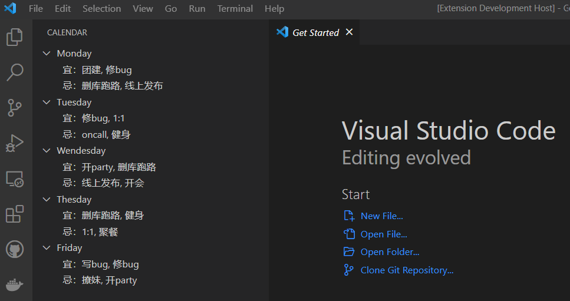
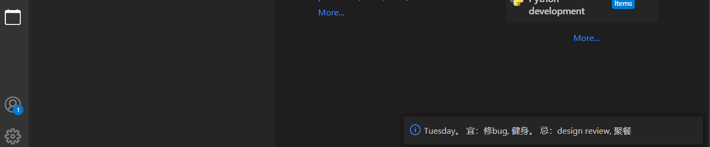

# Programmer Calendar 

This is a calendar which predict the action a programmer should do and should not do in the work days to have an easy life

[Donate by AliPay](https://github.com/huanyingtianhe/ProgrammerCalendar/blob/master/media/alipay.jpg?raw=true)
|
[Donate by wechat](https://github.com/huanyingtianhe/ProgrammerCalendar/blob/master/media/wechatpay.jpg?raw=true)

## Features

This calendar provide the goods and bads you should follow in the work days, and the idea comes from the traditional chinese calendar. it will change every week.

## Install

1. Select the "Week Calendar" in the command panel, it will show the week calendar in the left side bar

2. Select the "today" in the command panel, it will show the today information in the right down notice box.

## Extension Settings

none.

## Known Issues

none.